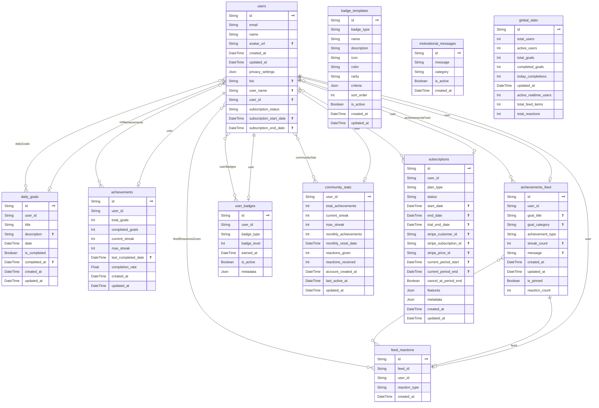

```mermaid
erDiagram

  "users" {
    String id "🗝️"
    String email 
    String name 
    String avatar_url "❓"
    DateTime created_at 
    DateTime updated_at 
    Json privacy_settings 
    String bio "❓"
    String user_name "❓"
    String user_id "❓"
    String subscription_status 
    DateTime subscription_start_date "❓"
    DateTime subscription_end_date "❓"
    }
  

  "daily_goals" {
    String id "🗝️"
    String user_id 
    String title 
    String description "❓"
    DateTime date 
    Boolean is_completed 
    DateTime completed_at "❓"
    DateTime created_at 
    DateTime updated_at 
    }
  

  "achievements" {
    String id "🗝️"
    String user_id 
    Int total_goals 
    Int completed_goals 
    Int current_streak 
    Int max_streak 
    DateTime last_completed_date "❓"
    Float completion_rate 
    DateTime created_at 
    DateTime updated_at 
    }
  

  "achievements_feed" {
    String id "🗝️"
    String user_id 
    String goal_title "❓"
    String goal_category "❓"
    String achievement_type 
    Int streak_count "❓"
    String message "❓"
    DateTime created_at 
    DateTime updated_at 
    Boolean is_pinned 
    Int reaction_count 
    }
  

  "user_badges" {
    String id "🗝️"
    String user_id 
    String badge_type 
    Int badge_level 
    DateTime earned_at 
    Boolean is_active 
    Json metadata 
    }
  

  "community_stats" {
    String user_id "🗝️"
    Int total_achievements 
    Int current_streak 
    Int max_streak 
    Int monthly_achievements 
    DateTime monthly_reset_date 
    Int reactions_given 
    Int reactions_received 
    DateTime account_created_at 
    DateTime last_active_at 
    DateTime updated_at 
    }
  

  "feed_reactions" {
    String id "🗝️"
    String feed_id 
    String user_id 
    String reaction_type 
    DateTime created_at 
    }
  

  "badge_templates" {
    String id "🗝️"
    String badge_type 
    String name 
    String description 
    String icon 
    String color 
    String rarity 
    Json criteria 
    Int sort_order 
    Boolean is_active 
    DateTime created_at 
    DateTime updated_at 
    }
  

  "motivational_messages" {
    String id "🗝️"
    String message 
    String category 
    Boolean is_active 
    DateTime created_at 
    }
  

  "global_stats" {
    String id "🗝️"
    Int total_users 
    Int active_users 
    Int total_goals 
    Int completed_goals 
    Int today_completions 
    DateTime updated_at 
    Int active_realtime_users 
    Int total_feed_items 
    Int total_reactions 
    }
  

  "subscriptions" {
    String id "🗝️"
    String user_id 
    String plan_type 
    String status 
    DateTime start_date "❓"
    DateTime end_date "❓"
    DateTime trial_end_date "❓"
    String stripe_customer_id "❓"
    String stripe_subscription_id "❓"
    String stripe_price_id "❓"
    DateTime current_period_start "❓"
    DateTime current_period_end "❓"
    Boolean cancel_at_period_end 
    Json features 
    Json metadata 
    DateTime created_at 
    DateTime updated_at 
    }
  
    "users" o{--}o "achievements" : "achievements"
    "users" o{--}o "achievements_feed" : "achievementsFeed"
    "users" o{--}o "community_stats" : "communityStat"
    "users" o{--}o "daily_goals" : "dailyGoals"
    "users" o{--}o "feed_reactions" : "feedReactionsGiven"
    "users" o{--}o "user_badges" : "userBadges"
    "users" o{--}o "subscriptions" : "subscription"
    "daily_goals" o|--|| "users" : "user"
    "achievements" o|--|| "users" : "user"
    "achievements_feed" o|--|| "users" : "user"
    "achievements_feed" o{--}o "feed_reactions" : "reactions"
    "user_badges" o|--|| "users" : "user"
    "community_stats" o|--|| "users" : "user"
    "feed_reactions" o|--|| "achievements_feed" : "feed"
    "feed_reactions" o|--|| "users" : "user"
    "subscriptions" o|--|| "users" : "user"
```
